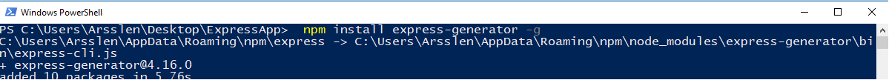
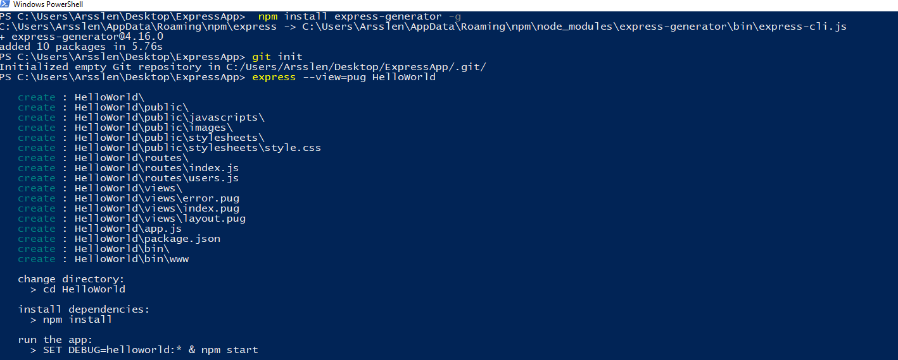
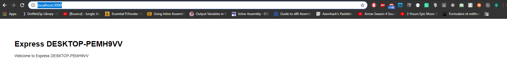
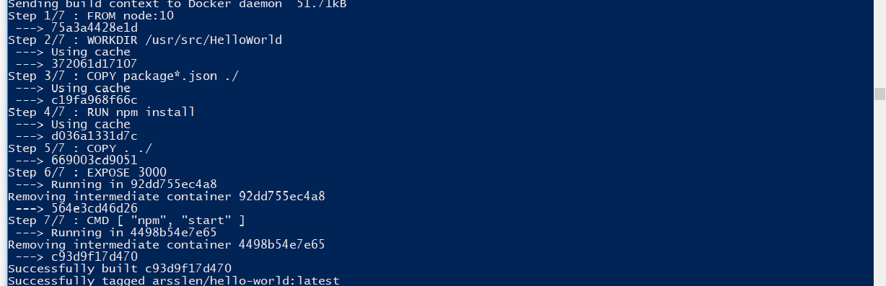
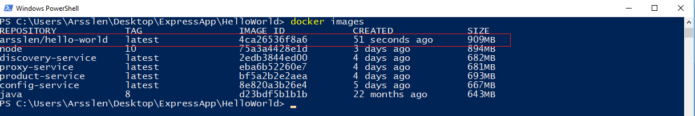
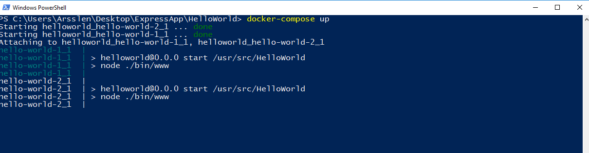
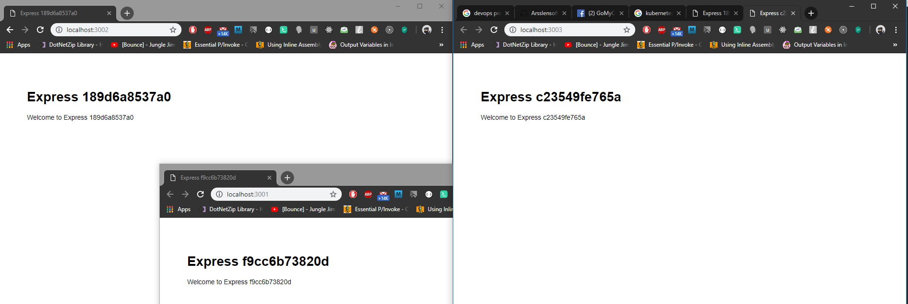

# Creating & Dockerizing an express application

## Creating the express app
Use the application generator tool, express-generator, to quickly create an application skeleton.

The express-generator package installs the express command-line tool. Use the following command to do so:
```shell 
npm install express-generator -g
```


We will create a simple app called HelloWorld

The following creates an Express app named **HelloWorld**. The app will be created in a folder named **HelloWorld** in the current working directory and the view engine will be set to Pug:

```shell
express --view=pug HelloWorld
```



## Installing dependencies
We need to install dependencies first

```shell 
cd HelloWorld
```
Then
```shell 
npm install
```
## Modifying your app
Open the ``routes/index.js`` in your favorite text editor

You should see this
```js 
var express = require('express');
var router = express.Router();

/* GET home page. */
router.get('/', function(req, res, next) {
  res.render('index', { title: 'Express' });
});

module.exports = router;
```

We will need to get the current hostname for later use,
so we will require the **os** package

we will add under ``var express = require('express');``
```js 
var os = require('os');
```

and we will change this line


```js 
  res.render('index', { title: 'Express' });
```
To this
```js 
  res.render('index', { title: 'Express ' + os.hostname() });
```

The final file should look like this
```js 
var express = require('express');
var os = require('os');
var router = express.Router();


/* GET home page. */
router.get('/', function(req, res, next) {
  res.render('index', { title: 'Express ' + os.hostname() });
});

module.exports = router;
```


## Running the application
We just need to type:
```shell 
SET DEBUG=helloworld:*
```
Then
```shell 
npm start
```

Wait a little then go to http://localhost:3000/

you'll see this


## Dockerizing the application
In this steps, we'll look at how you can run this app inside a Docker container using the official Docker image. First, you'll need to build a Docker image of your app.

### Creating a Dockerfile
Create an empty file called ``Dockerfile``

Open the ``Dockerfile`` in your favorite text editor

The first thing we need to do is define from what image we want to build from. Here we will use the latest LTS (long term support) version 10 of node available from the Docker Hub:
```Dockerfile 
FROM node:10
```

Next we create a directory to hold the application code inside the image, this will be the working directory for our application:

```Dockerfile 
# Create app directory
WORKDIR /usr/src/HelloWorld
```

This image comes with Node.js and NPM already installed so the next thing we need to do is to install your app dependencies using the npm binary. Please note that if you are using npm version 4 or earlier a package-lock.json file will not be generated.
```Dockerfile 
# Install app dependencies
# A wildcard is used to ensure both package.json AND package-lock.json are copied
# where available (npm@5+)
COPY package*.json ./

RUN npm install
# If you are building your code for production
# RUN npm install --only=production
```

Note that, rather than copying the entire working directory, we are only copying the package.json file. This allows us to take advantage of cached Docker layers. bitJudo has a good explanation of this here: http://bitjudo.com/blog/2014/03/13/building-efficient-dockerfiles-node-dot-js/

To bundle your app's source code inside the Docker image, use the COPY instruction:
```Dockerfile 
# Bundle app source
COPY . ./
```

Your app binds to port 3000 so you'll use the EXPOSE instruction to have it mapped by the docker daemon:

```Dockerfile 
EXPOSE 3000
```

Last but not least, define the command to run your app using CMD which defines your runtime. Here we will use the basic npm start which will run node server.js to start your server:

```Dockerfile 
CMD [ "npm", "start" ]
```

### All in one file
Your Dockerfile should now look like this:
```Dockerfile 
FROM node:10

# Create app directory
WORKDIR /usr/src/HelloWorld

# Install app dependencies
# A wildcard is used to ensure both package.json AND package-lock.json are copied
# where available (npm@5+)
COPY package*.json ./

RUN npm install
# If you are building your code for production
# RUN npm install --only=production

# Bundle app source
COPY . ./

EXPOSE 3000
CMD [ "npm", "start" ]
```

### Docker Ignore
Create a ``.dockerignore`` file in the same directory as your ``Dockerfile`` with following content:
```
node_modules
npm-debug.log
```
This will prevent your local modules and debug logs from being copied onto your Docker image and possibly overwriting modules installed within your image.

### Building the docker image
Go to the directory that has your ``Dockerfile`` and run the following command to build the Docker image. The ``-t`` flag lets you tag your image so it's easier to find later using the ``docker images`` command:

```shell
docker build -t arsslen/hello-world .
```

### Listing your docker images
Your image will now be listed by Docker:

```shell
docker images
```



### Running your container
There is two methods to run your container
- Using ``docker run`` command
- Using ``docker-compose``

#### Running using docker run
Running your image with``-d `` runs the container in detached mode, leaving the container running in the background. The ``-p`` flag redirects a public port to a private port inside the container. Run the image you previously built:
```shell
docker run -p 3001:3000 -d arsslen/hello-world
```

The public port will be 3001 you can check http://localhost:3001/

#### Running using docker-compose
Create a ``docker-compose.yml``

Open the ``docker-compose.yml`` in your favorite text editor

Add this code
```YAML
version: '2.0'
services:
    hello-world-1:
        image: arsslen/hello-world
        ports:
            - "3002:3000"
        expose:
            - 3002
        networks:
            - arsslens-network
    hello-world-2:
        image: arsslen/hello-world
        ports:
            - "3003:3000"
        expose:
            - 3003
        networks:
            - arsslens-network

networks:
    arsslens-network:
        driver: bridge
```
To run it it's easy just type ``docker-compose up``, please make sure you are in the same directory as you **docker-compose.yml**.

Finally you'll see this starting




The public port will be 3002 and 3003 since we've started two containers, you can check 

http://localhost:3002/

http://localhost:3003/

We use generally docker compose if we want to automate container execution and define dependencies or networks.
## Conclusion
Finally we can see this


Docker is not just this, google it
